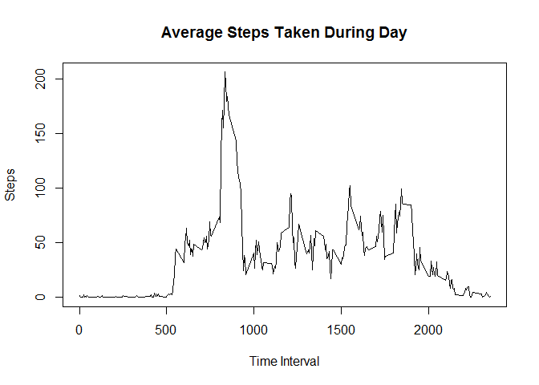
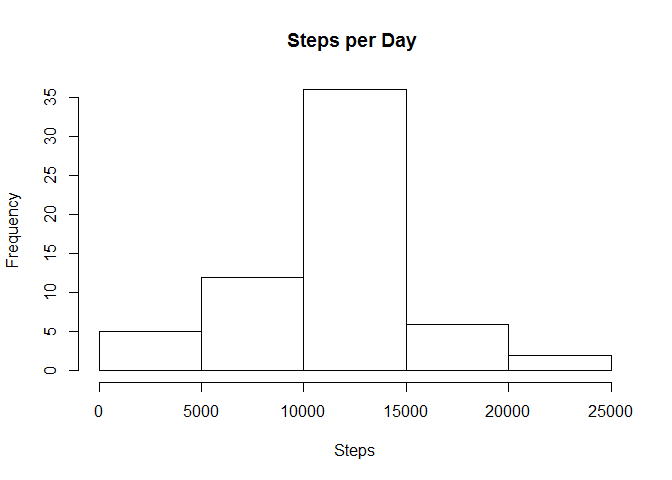
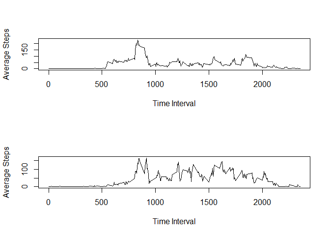

# Reproducible Research: Peer Assessment 1


## Loading and preprocessing the data

```r
activity <- read.csv("activity.csv")
activity2 <- aggregate(x = activity[,c(1)], by = list(activity$date), FUN = sum)
interval_average <- aggregate(activity[,c(1)], list(activity$interval), mean, na.rm = TRUE)

#split by date
list <- split(x = activity[,c(1)], f = activity$interval)
interval_mean <- lapply(list, mean, na.rm = TRUE)
```


## What is mean total number of steps taken per day?
### 1.

```r
hist(activity2$x, main = "Steps per Day", xlab = "Steps")
```

 

### 2.

```r
mean(activity2$x, na.rm = TRUE)
```

```
## [1] 10766.19
```

```r
median(activity2$x, na.rm = TRUE)
```

```
## [1] 10765
```


## What is the average daily activity pattern?
### 1.

```r
#find mean for each interval
interval_average <- aggregate(activity[,c(1)], list(activity$interval), mean, na.rm = TRUE)

plot(interval_average, type ="l", xlab = "Time Interval", ylab = "Steps", 
     main = "Average Steps Taken During Day")
```

 

### 2.

```r
interval_average[max(interval_average$x),c(1)]
```

```
## [1] 1705
```


## Imputing missing values
### 1.

```r
# Number of missing values
sum(is.na(activity))
```

```
## [1] 2304
```
### 2.
Missing data will be filled in using the mean of the missing time interval. 

### 3.

```r
#fill missing data with average of that time interval
for(i in 1:length(activity$steps)){
    if(is.na(activity$steps[i])){
        activity$steps[i] <- interval_mean[[as.character(activity$interval[i])]]
    }
}
```

### 4.

```r
#
activity3 <- aggregate(x = activity[,c(1)], by = list(activity$date), FUN = sum)

hist(activity3$x, main = "Steps per Day ", xlab = "Steps")
```

 

```r
mean(activity3$x)
```

```
## [1] 10766.19
```

```r
median(activity3$x)
```

```
## [1] 10766.19
```

The number of days with an average amount of walking is increased due to using the averages for the missing intervals. 


## Are there differences in activity patterns between weekdays and weekends?
### 1.

```r
activity$date <- as.Date(activity$date)
activity["day"] <- NA
for(i in 1:length(activity$day)){
    if(weekdays(activity$date[i]) == "Saturday" | weekdays(activity$date[i]) == "Sunday"){
        activity$day[i] <- "Weekend"
    }
    else
        activity$day[i] <- "Weekday"
        
}
activity$day <- as.factor(activity$day)

weekdays <- activity[activity$day == "Weekday",]
weekend <- activity[activity$day == "Weekend",]
weekday_average <- aggregate(weekdays[,c(1)], list(weekdays$interval), mean, na.rm = TRUE)
weekend_average <- aggregate(weekend[,c(1)], list(weekend$interval), mean, na.rm = TRUE)
```

### 2.

```r
par(mfrow = c(2,1))
plot(weekday_average$Group.1,weekday_average$x, type = "l", xlab = "Time Interval", 
     ylab = "Average Steps")
plot(weekend_average$Group.1,weekend_average$x, type = "l", xlab = "Time Interval",
     ylab = "Average Steps")
```

 

